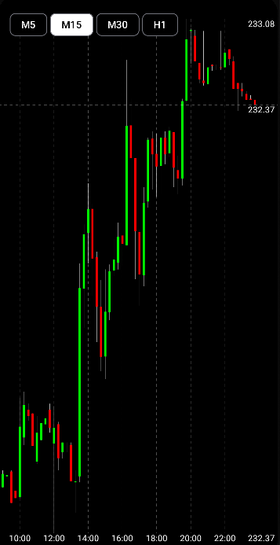

# PriceChart App
## Technology stack
The source code of the application was written in Kotlin. MVVM was used as an architectural template. Interaction with the network was implemented using Retrofit. Coroutine is used for asynchronous operation. The graph was drawn using Canvas. Hilt was used to implement dependency injection. The application uses Jetpack Compose.
API: https://polygon.io/
## Screenshots

